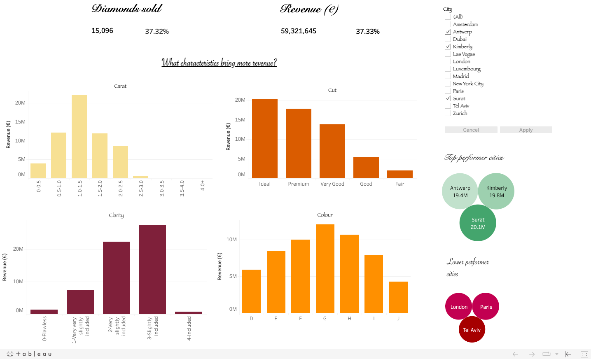

# The Diamond Store 

In this repository we are going to explore the characterstics of the sales of the Diamond Store in the past year. 
- We will first obtain the data from our database via **Dbeaver**
- We will manipulate it in order to build our dashboard with the help of **pandas**
- We will built a revenue dashboard on **Tableau**
- We will come up with very interesting **insights for the whole company as well as each local store**. 

---

## __Step 1: Data Exploration and Preparation__

Starting form the diamonds.db, we connected DBeaver so that with help of SQL we could export the **diamonds.csv** to start working with: 

From this **diamonds.csv**, pandas was applied to group and filter information in order to built the visualizations that as we were exploring the dataset, we found more relevant to offer. 

---

## __Step 2: BI report__

The goal of this BI report is to help the company understand in global and local persepctive which diamond characteristics bring more revenue to the company. 

Main fields of this BI report: 
- On top of the dashboard we can find the total number of diamonds and total revenue achieved by the company in the last year
- On the top right we can find a city filter that will allow us to otain these two values at city level as well as undertand the percentage that city represents in terms of sales and revenue to the company
- After that, there is a visualization for each characterisctic of a diamond (carat, cut, clarity, color) and how each one of their ranges contributed to revenue achievement. These visualizations are also affected by the city filter on the top right. 
- Last but not least, there is also a fixed visualization of the top 3 and lowest 3 performer cities in order to be aware if actions should be taken. 

Tableau link: https://public.tableau.com/shared/XMW3ZHYZR?:display_count=n&:origin=viz_share_link

---

## __Step 3: Insights__

> __Insight 1:__ Almost 40% of the revenue is leaded by three cities: Surat, Kimberly & Antwerp.

We could guess here that these three cities have culturally more interest in buying diamonds than european ones but would be intersting to validate if that is the case or if we might be having better sale techniques from which other cities could learn for example. 

> __Insight 2:__ Our star: diamonds with Carat between 1.0 and 1.5.

We have been doing a lot of efforts to achieve diamonds with greater carats than 2.5 but the reality is that diamonds with less than 1.5 are the ones that pay our food. We should aim to buy and acquire diamonds in this range.  

> __Insight 3:__ We must acquire the best Cut possible.

The better the cut, the more revenue it brigns us. So the cut of the diamond that we want to acquire shoudl be between ideal and Premium cut.  

> __Insight 4:__ Clarity: slightly included diamonds.

When talking about clarity, this do not seem to be a relevant factor between the difrent slightly included levels. 

> __Insight 4:__ Colour is not a relevant differentiator.

We know that colourless diamonds are the best but numbers tell us that we culd be flexible on the acquisiton of different colour ranges.    

---

## **References:**

- [SQLite](https://www.sqlite.org/index.html)

- [SQLAlchemy](https://docs.sqlalchemy.org/en/14/core/engines.html)

- [Visual Analysis Best Practices](https://github.com/ih-datapt-mad/ih_datamadpt1121_project_m2/blob/main/images/visual-analysis-guidebook.pdf)

- [Financial Times Visual Vocabulary](https://github.com/ft-interactive/chart-doctor/tree/master/visual-vocabulary)

- [Matplotlib](https://matplotlib.org/stable/api/index)

- [Pandas Visualization](https://pandas.pydata.org/docs/reference/api/pandas.DataFrame.plot.html)

- [Seaborn](https://seaborn.pydata.org/api.html)

- [Plotly](https://plotly.com/graphing-libraries/)

- [Cufflinks](https://coderzcolumn.com/tutorials/data-science/cufflinks-how-to-create-plotly-charts-from-pandas-dataframe-with-one-line-of-code)

- [Tableau](https://github.com/ih-datapt-mad/dataptmad1121_lessons/blob/main/module-2/visualization_tableau.md)

- [Power BI](https://github.com/potacho/power_bi_workshop)